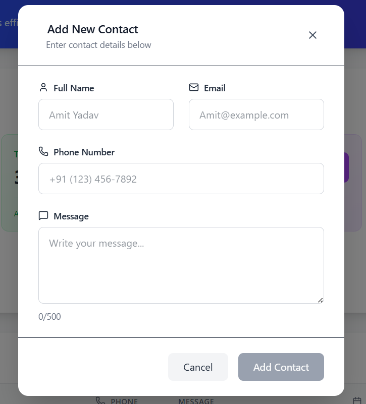
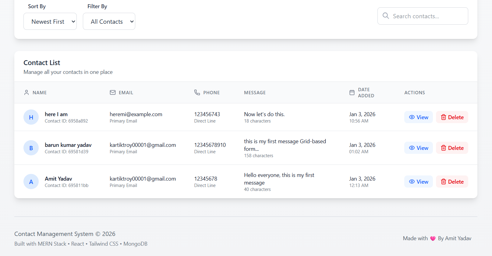

<div align="center">
  <br />
    <h1 align="center">Contact Management System</h1>

<br />

<div>

</div>

</div>


## <a name="introduction">✨ Introduction</a>
A modern, full-featured Contact Management Web Application built with the MERN stack (MongoDB, Express.js, React, Node.js). This application allows users to manage their contacts efficiently with a beautiful, responsive UI and comprehensive functionality.

## 🎯 Live Demo
Live Application URL: https://your-live-demo-link-here


## ✨ Features

- Professional Dashboard with real-time statistics

- Responsive Design that works on all devices

- Beautiful Gradient Color Scheme with smooth animations

- Lucide React Icons for enhanced visual appeal

- Interactive Modals for detailed views and forms

- Sorting & Filtering options for easy contact management

## ⚙️ Setup Instructions


### Installation

1.  **Clone the repository:**
    ```bash
    git clone <repository-url>
     https://github.com/Amit-yadav099/CollEdge-Connect-work.git
    ```

2.  **Backend Setup:**
    ```bash
    cd backend
    npm install
    ```
   
    **Create .env file in the backend directory :**
    ```bash
    PORT=5000
    MONGODB_URI=mongodb://localhost:27017/contact_manager
    NODE_ENV=development
    ```

3.  **Frontend Setup:**
    ```bash
    cd frontend   
    npm install
    ```
    **Create .env file in the frontend directory:**
     ```bash
     REACT_APP_API_URL=http://localhost:5000/api
     ```

4.  **Run the Application:**
    
    Start the backend Server
    ```bash
    cd backend
    npm run dev
    # Server runs on http://localhost:5000
    ```
    Start the frontend Server
    ```bash
    cd frontend
    npm start
    # App runs on http://localhost:3000
    ```

## <a name="Project">Project Structure</a>
``` bash
contact-manager/
├── backend/
│   ├── server.js              # Main server file
│   ├── package.json           
│   ├── .env                  # Environment variables
│   ├── models/
│   │   └── Contact.js        # MongoDB schema
│   ├── routes/
│   │   └── contacts.js       # API routes
│   └── middleware/
│       └── errorMiddleware.js # Error handling
└── frontend/
    ├── public/
    │   └── index.html       
    ├── src/
    │   ├── App.js            # Main React component
    │   ├── index.js          # React entry point
    │   ├── components/
    │   │   ├── Header.js     # Application header
    │   │   ├── StatsDashboard.js # Stats dashboard
    │   │   ├── ContactTable.js   # Contact table
    │   │   ├── ContactDetailModal.js # Detail modal
    │   │   ├── ContactFormModal.js   # Form modal
    │   │   └── Alert.js      # Notification component
    │   └── services/
    │       └── api.js        
    └── package.json          
```
## <a name="key-featuere">🎯 Key Features in Detail</a>

📋 Core Functionality
-  Contact Creation with form validation

-  Contact Listing in tabular format with pagination

-  Contact Details View with comprehensive information

-  Contact Deletion with confirmation

-  Real-time Validation for all form fields

-  Responsive Table with search capabilities

-  Statistics Dashboard with metrics

<br>

🚀 Advanced Features
- Pagination for large contact lists

- Sorting by name, date, and other criteria

- Filtering by time periods (today, week, month)

- Export Ready contact data

- Success/Error Notifications

- Loading States and skeleton screens

- Dark/Light Mode Ready design

<br>

🎨 UI/UX Features
- Professional Dashboard with real-time statistics

- Responsive Design that works on all devices

- Beautiful Gradient Color Scheme with smooth animations

- Lucide React Icons for enhanced visual appeal

- Interactive Modals for detailed views and forms

- Sorting & Filtering options for easy contact management

<br>

📚 Technologies Used
 
 Frontend:

- React 18.2.0

- Tailwind CSS 3.3.0

- Lucide React (for icons)

- Axios (for API calls)

- React Modal

Backend:
- Node.js 18.x

- Express.js 4.18.2

- MongoDB with Mongoose ODM

- CORS for cross-origin requests

- Dotenv for environment variables

<br>


Endpoints:

- GET /api/contacts - Get all contacts

- GET /api/contacts/:id - Get single contact

- POST /api/contacts/ - create new contact

- DELETE /api/contacts/:id - Delete contact

<br>

## <a name="Images">Different frontend UI</a>

<br></br>


